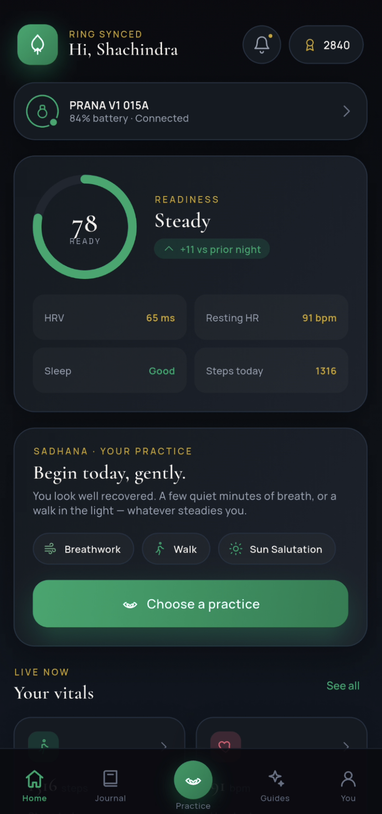
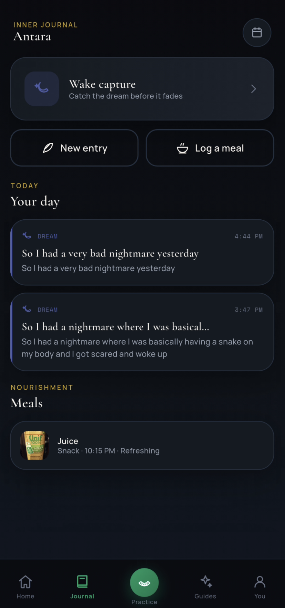
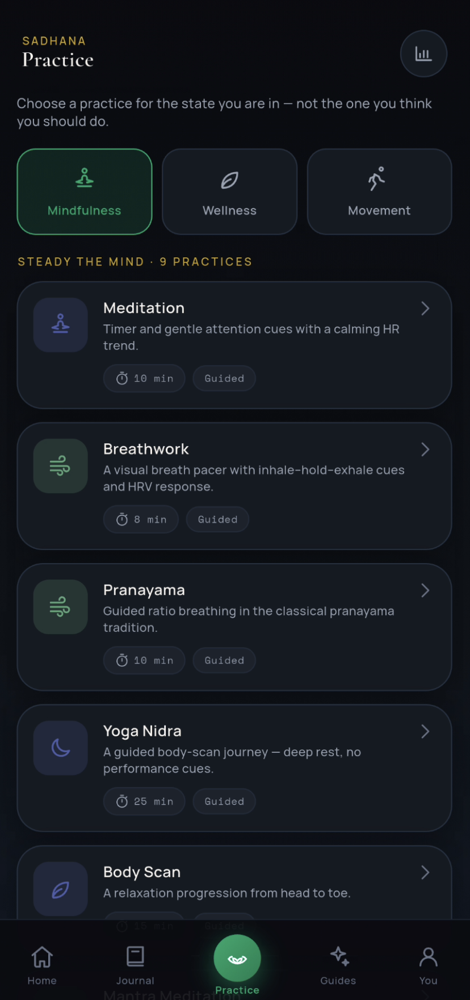
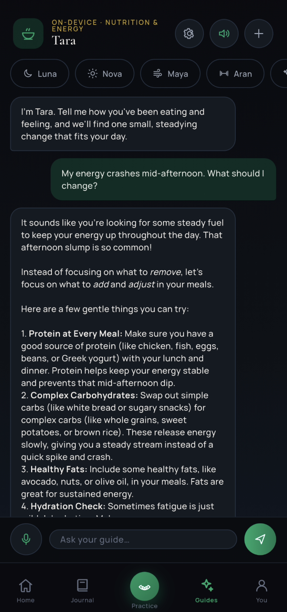

# Vyana App

Vyana is a sovereign wellness companion for the PRANA smart ring — practice
tracking, vitals, on-device AI guides, and optional Solana wallet integration.
Your signals stay on your phone. Built by [Seek Nirvana](https://seeknirvana.com).

<p align="center">
  
  <br/>
  
  
</p>

## Features

- **PRANA ring** — BLE scan, pair, reconnect, vitals sync, sleep analytics, measurements
- **Sadhana** — breath, movement, and rest practices with session tracking
- **On-device AI guides** — private Gemma-based companions; nothing sent to the cloud
- **Journal & insights** — local vault for sessions, meals, and weekly patterns
- **Solana wallet** — Mobile Wallet Adapter on Seeker/Saga; Reown on other Android/iOS
- **Privacy-first** — no account required; ring data and practice history stay on-device

## Requirements

| Platform | Minimum |
|----------|---------|
| Android | API 26 (8.0), **arm64** for AI guides |
| iOS | 16.0 |
| Flutter | SDK ^3.12 (see `pubspec.yaml`) |

On-device AI guides download a ~3 GB model at runtime. Ring, vitals, and wallet
features work without it.

## Quick start

```bash
git clone https://github.com/SeekNirvana/vyana_app.git
cd vyana_app
cp .env.example .env    # add your Reown project ID (optional for ring-only use)
flutter pub get
flutter run
```

`.env` is gitignored. Never commit it. See [`.env.example`](.env.example) for
wallet and RPC variables.

## Build

Debug and release instructions (flavors, signing, dApp Store APK) are in
[`docs/building.md`](docs/building.md).

## SDK

Ring hardware integration uses [vyana_sdk](https://github.com/SeekNirvana/vyana_sdk)
(LGPL-3.0), pinned in `pubspec.yaml`.

## Contributing

See [CONTRIBUTING.md](CONTRIBUTING.md). Run `flutter analyze` and `flutter test`
before opening a PR.

## Security

Report vulnerabilities per [SECURITY.md](SECURITY.md). Do not open public issues
for secret leaks.

## License

Copyright (C) 2026 Seek Nirvana. Licensed under [GPL-3.0](LICENSE). See [COPYRIGHT](COPYRIGHT).