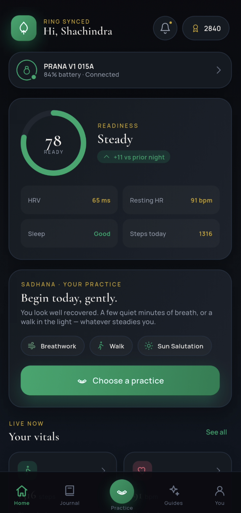
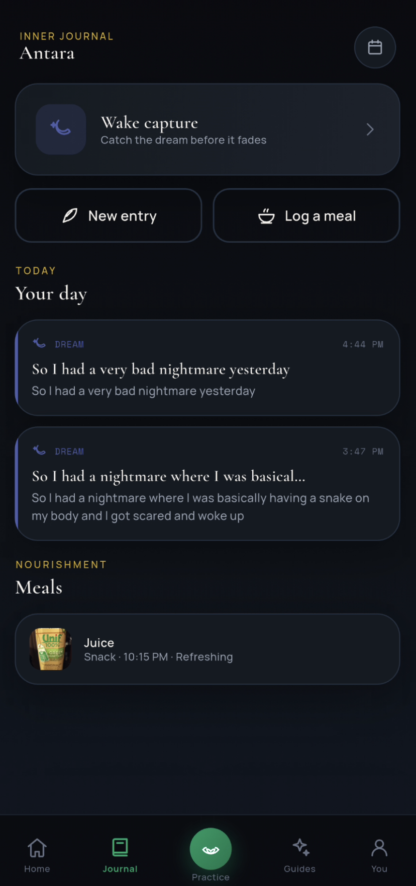
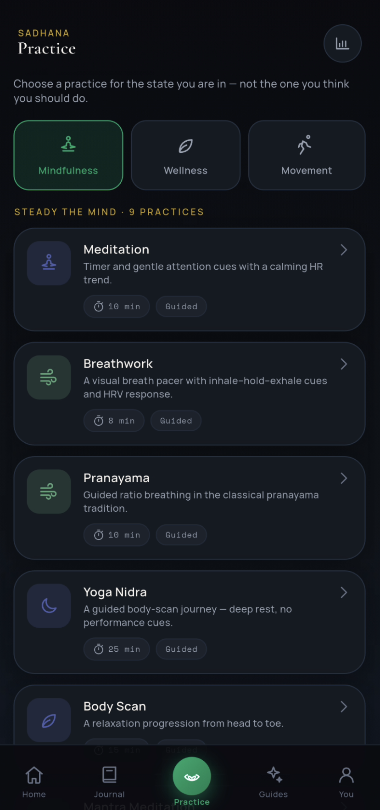
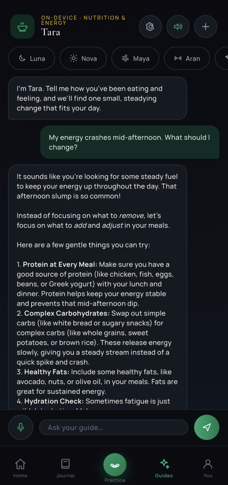

# Vyana App

Vyana is a sovereign wellness companion for the PRANA smart ring — practice
tracking, vitals, on-device AI guides, and optional Solana wallet integration.
Your signals stay on your phone. Built by [Seek Nirvana](https://seeknirvana.com).

<p align="center">
  
  <br/>
  
  
</p>

## Features

- **Five tabs** — Home · Metrics · Practice · Journal · You (Vyana 2.0)
- **PRANA ring** — BLE scan, pair, background auto-reconnect, sleep analytics, on-demand vitals and ECG; Home shows one honest ring state (synced · syncing · SYNC · CONNECT)
- **Home** — today's readiness read from overnight HRV and last night's sleep, three metric cards, a Recover / Perform / Settle intent pre-set from your own history, one suggested practice of four minutes or less, and what you have already done today
- **Personal baselines** — judged against a typical adult for two weeks, then against your own normal; Nova asks about the feeling, never the number, and clinical floors are never personalised
- **Metrics** — 7D / 30D / 90D readiness chart, every vital against a reference window *and* your own baseline, ECG, and opt-in cycle tracking with a calendar and pregnancy mode
- **Practice** — breath, movement, heat and rest practices with pinned favourites, search, your own sports, timed practices that actually end, and a findable history
- **Journal** — local vault for entries, wake capture and meals, all editable, plus the patterns Nova finds across them with the evidence shown
- **Nova** — one private on-device AI guide (Gemma-based); nothing leaves the phone
- **Solana wallet** — Mobile Wallet Adapter on Seeker/Saga; Reown on other Android/iOS
- **Privacy-first** — no account required; ring data, journal, cycle and practice history stay on-device, exportable from You

## Requirements

| Platform | Minimum |
|----------|---------|
| Android | API 26 (8.0), **arm64** for AI guides |
| iOS | 16.0 |
| Flutter | SDK ^3.12 (see `pubspec.yaml`) |

Nova downloads a ~3.1 GB model at runtime. Ring, vitals, journal, and wallet
features work without it.

## Quick start

```bash
git clone https://github.com/SeekNirvana/vyana_app.git
cd vyana_app
cp .env.example .env    # add your Reown project ID (optional for ring-only use)
flutter pub get
flutter run
```

`.env` is gitignored. Never commit it. See [`.env.example`](.env.example) for
wallet and RPC variables.

## Build

Debug and release instructions (flavors, signing, dApp Store APK) are in
[`docs/building.md`](docs/building.md).

## SDK

Ring hardware integration uses [vyana_sdk](https://github.com/SeekNirvana/vyana_sdk)
(LGPL-3.0), pinned in `pubspec.yaml`.

## Contributing

See [CONTRIBUTING.md](CONTRIBUTING.md). Run `flutter analyze` and `flutter test`
before opening a PR.

## Security

Report vulnerabilities per [SECURITY.md](SECURITY.md). Do not open public issues
for secret leaks.

## License

Copyright (C) 2026 Seek Nirvana. Licensed under [GPL-3.0](LICENSE). See [COPYRIGHT](COPYRIGHT).